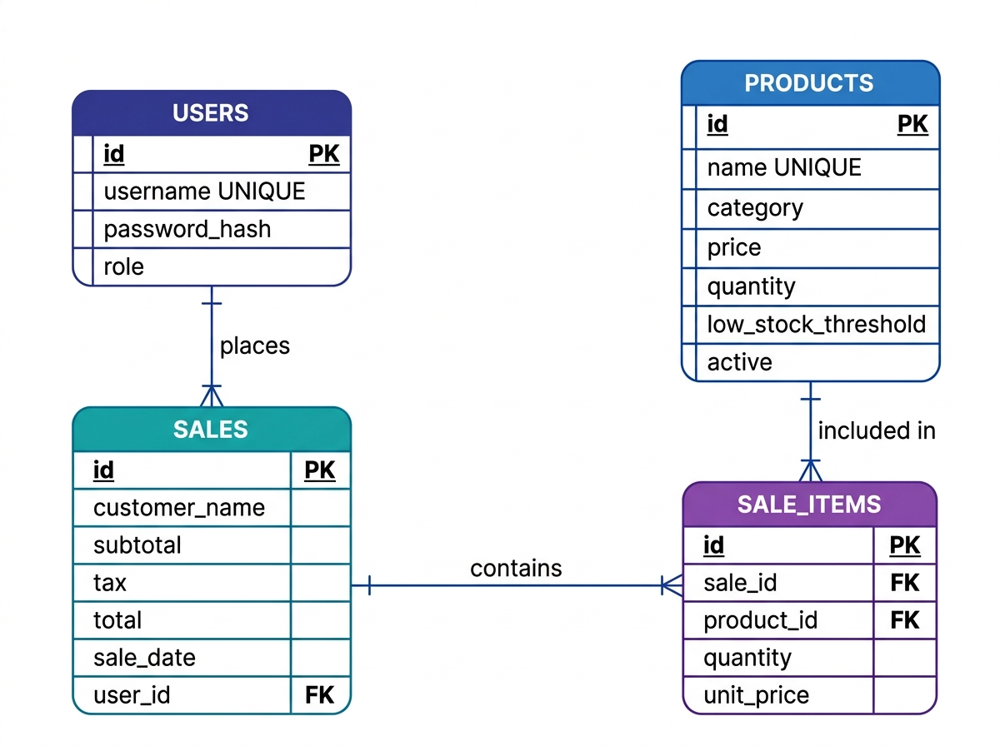

# 📋 System Requirements & Architecture Specification

**Project Name:** Smart Mart — Inventory & Billing Management System  
**Document Version:** 1.0.0  
**Author:** Suman Mondal  
**Date:** October 2026  

---

## 1. Executive Summary

The **Smart Inventory & Billing Management System** is an offline-capable, lightweight desktop application designed for small-to-medium retail enterprises. It streamlines checkout billing, automates PDF invoice generation, manages stock inventory, detects low-stock conditions in real time, and produces comprehensive sales reports with visual trend analytics.

---

## 2. System Architecture & Tech Stack

### 2.1 Software Stack
- **Language:** Python 3.9+
- **GUI Framework:** Tkinter / ttk (Custom styled with clam engine)
- **Database Engine:** SQLite 3 (ACID compliant with Foreign Key constraints)
- **Document Generation:** ReportLab 5.0 (PDF rendering)
- **Analytics & Data Visualization:** Matplotlib 3.9 (Embedded TkAgg canvas)
- **Security:** bcrypt 5.0 (Salted password hashing)

### 2.2 System Architecture Diagram
```
┌─────────────────────────────────────────────────────────────────┐
│                    Tkinter User Interface                       │
│  (LoginWindow, Dashboard, BillingFrame, ProductFrame, Reports)  │
└───────────────────────────────┬─────────────────────────────────┘
                                │
┌───────────────────────────────▼─────────────────────────────────┐
│                        Services Layer                           │
│ (AuthService, InventoryService, BillingService, ReportService)  │
└───────────────┬───────────────────────┬─────────────────────────┘
                │                       │
┌───────────────▼─────────┐   ┌─────────▼─────────┐
│    SQLite Database      │   │  ReportLab PDF    │
│ (inventory.db via db.py)│   │  Invoice Engine   │
└─────────────────────────┘   └───────────────────┘
```

---

## 3. Database Design & Entity-Relationship (ER) Diagram

### 3.1 ER Diagram


### 3.2 Schema Specifications

#### `users` Table
- `id` (INTEGER PRIMARY KEY AUTOINCREMENT): Unique user identifier.
- `username` (TEXT UNIQUE COLLATE NOCASE): Login account name.
- `password_hash` (BLOB NOT NULL): Salted bcrypt hash of password.
- `role` (TEXT CHECK ('Admin', 'Staff')): System role privileges.

#### `products` Table
- `id` (INTEGER PRIMARY KEY AUTOINCREMENT): Product SKU code.
- `name` (TEXT NOT NULL): Product title.
- `category` (TEXT DEFAULT ''): Category grouping.
- `price` (REAL CHECK (price >= 0)): Unit price in INR (Rs.).
- `quantity` (INTEGER CHECK (quantity >= 0)): Available inventory count.
- `low_stock_threshold` (INTEGER DEFAULT 5): Reorder trigger point.
- `active` (INTEGER DEFAULT 1): Soft-delete status indicator.

#### `sales` Table
- `id` (INTEGER PRIMARY KEY AUTOINCREMENT): Sequential invoice/bill number.
- `customer_name` (TEXT DEFAULT ''): Optional customer name.
- `subtotal` (REAL NOT NULL): Total before tax.
- `tax` (REAL NOT NULL): Calculated tax amount (5% default).
- `total` (REAL NOT NULL): Grand total bill amount.
- `sale_date` (TEXT DEFAULT current timestamp): Timestamp of transaction.
- `user_id` (INTEGER REFERENCES users): Cashier who processed transaction.

#### `sale_items` Table
- `id` (INTEGER PRIMARY KEY AUTOINCREMENT): Line item identifier.
- `sale_id` (INTEGER REFERENCES sales): Parent sale record.
- `product_id` (INTEGER REFERENCES products): Purchased product item.
- `quantity` (INTEGER CHECK (quantity > 0)): Units sold.
- `unit_price` (REAL NOT NULL): Historical unit price at time of sale.

---

## 4. Functional Requirements

### FR-01: Authentication & Authorization
- **FR-01.1:** Users must log in with username and password.
- **FR-01.2:** Passwords must be hashed using `bcrypt`. Plain text passwords are strictly forbidden.
- **FR-01.3:** Role-based access control (RBAC):
  - **Admin:** Full access to Billing, Inventory CRUD, History, Sales Reports, and User Management.
  - **Staff:** Restricted access to Billing, Stock View (Read-Only), and History.

### FR-02: Inventory & Stock Management
- **FR-02.1:** Admins can add, update, and soft-delete products.
- **FR-02.2:** Real-time stock status color coding (Red background for quantity ≤ threshold).
- **FR-02.3:** Soft deletion preserves past sales reporting integrity when products are discontinued.

### FR-03: Billing & Cart Management
- **FR-03.1:** Instant live search of products by name or category.
- **FR-03.2:** Double-click or button press to add products to shopping cart.
- **FR-03.3:** Automatic validation against stock count to prevent overselling.
- **FR-03.4:** Real-time subtotal, tax calculation (5%), and grand total updates.

### FR-04: PDF Invoice Generation
- **FR-04.1:** Auto-generation of PDF invoices in `invoices/` folder upon checkout.
- **FR-04.2:** Option to open PDF invoice immediately after transaction completes.

### FR-05: Sales Reporting & Analytics
- **FR-05.1:** Sales summary aggregated by Day, Week, or Month.
- **FR-05.2:** Top 5 best-selling products calculation based on units sold.
- **FR-05.3:** Embedded Matplotlib bar chart illustrating periodic revenue trends.
- **FR-05.4:** One-click CSV export capability for financial accounting.

---

## 5. Non-Functional Requirements

### NFR-01: Performance & Responsiveness
- Main application window launch time under 1.5 seconds on dual-core laptops.
- Database query latency under 10ms for inventory lookups.

### NFR-02: UI & User Experience (UX)
- Designed to fit standard 1366x768 laptop screens and higher desktop resolutions.
- Custom modern theme with indigo color accents (`#5b5ef4`), rounded cards, clear hierarchy, and emoji indicators.

### NFR-03: Reliability & Data Safety
- SQLite foreign key constraints enabled via `PRAGMA foreign_keys = ON`.
- Transactional commits (`self.conn.commit()`) ensure atomic sale creation.

---

## 6. Hardware & Software Compatibility

- **Operating System:** Windows 10 / Windows 11 / Linux / macOS
- **Display Resolution:** Minimum 1100x680 pixels
- **RAM:** Minimum 2 GB RAM
- **Python Version:** 3.9, 3.10, 3.11, 3.12, 3.13
